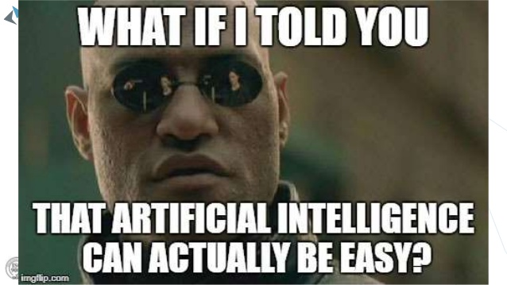

# WWT_GenAlgo

```
WWT_GenAlg est un algorithme génétique qui entraine (et sélectionne) le réseau de neurones faisant 
le meilleur score sur West World Tycoon
```



## Motivations

* Je m'interresse en ce moment beaucoup aux réseaux de neurones et plus particulièrement au `deep learning`.
* Les jeux étant un terrain privilégié pour s'entrainer dans ce domaine, il ne m'a pas fallu beaucoup de temps en voyant le sujet pour me lancer dans la création d'un réseau de neurones.

## Pourquoi un algorithme génétique

* J'avais déjà fait par le passé un algorithme génétique (sans réseau de neurones), et en avait gardé un très bon souvenir : c'est assez surprennant de voir l'efficacité du principe de sélection naturelle et d'hérédité, tout en se disant que la même chose s'applique dans le monde réel

## Fonctionnement

### Prérequis

* Python 3 et supérieur
* Jupyter Notebook
* Le module python tqdm pour avoir les bar de progression
* Le jeu West World Tycoon

### Utilisation

* Ouvrer GenAlgo.ipynb avec Jupyter Notebook
* A la fin du training vous pouvez sauvegarder le meilleur réseau de neurones au format .ia avec
```python
save_weight(score, weights)
```

### Fonctionnement

* Voir GenAlgo.ipynb

### Performance

* Maximum atteint : 30 078 527 (plusieurs heures d'entrainement)

## Pour aller plus loin

* Donner au réseau de neurones la possibilité de détruire les batiments (Essaie non concluant avec les paramètres actuels)
* Augmenter le nombre de couches du réseau de neuronnes (Amélioration des performances trop lente)
* Apprentissage par renforcement avec par exemple `OpenAI Gym`, cette possibilité m'intéresse beaucoup et permettrait surement de dépasser le score actuel mais ayant un temps trop court, je n'ai pas pu l'explorer
